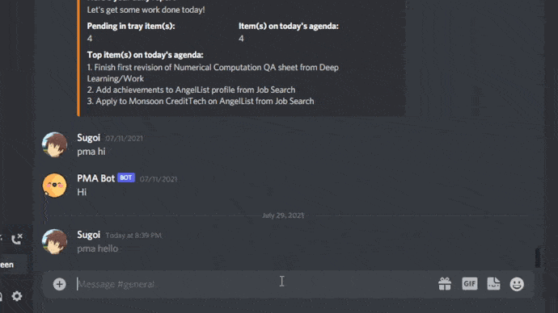

<h1 align='center'>Personal Assistant Bot</h1>

<div align="center">
    
    
</div>

A bot that automates certain repetitive tasks in the [productivity system](https://gettingthingsdone.com/) I've created in [Notion](https://www.notion.so/). Uses [Discord](https://discord.com/) as a front end for interacting with the user, and can understand natural language to a certain extent.

Here's a small demo:



I cannot show my Notion (for obvious reasons), but its pulling data from there (and in some cases, adding data too).

## Current functionality

1. Can pull data from specified Notion pages.
2. Marks certain pages as unread if there's content in them.
3. Gives a daily report every morning of all the pending tasks for today and other relevant things.

# How to use

This bot is hardcoded for my Notion setup at the moment. I couldn't think of a way to generalize it given the current state of the Notion API (and my laziness).

So feel free to fork this repo and modify it for your use case.

To install all the requirements:
```
pip install -r requirements.txt
```